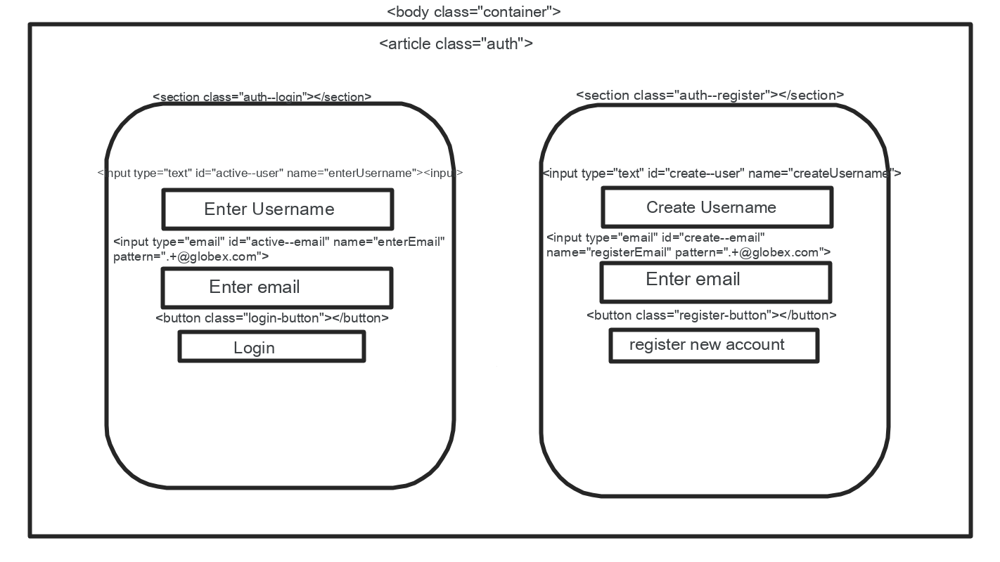
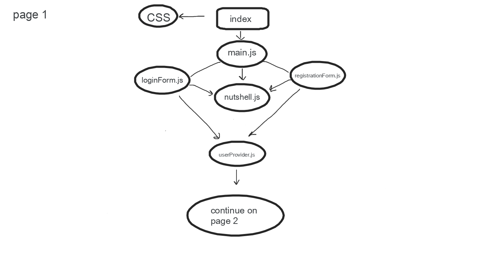
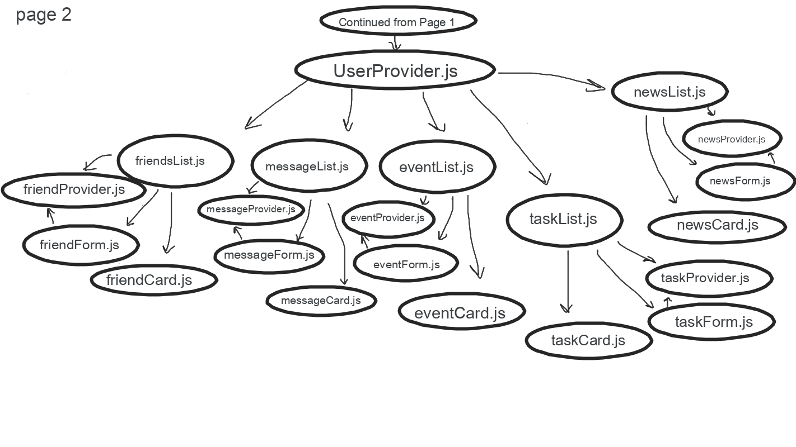

If you want to clone our repository, see below.

1. git clone git@github.com:nss-day-cohort-44/nutshell-hunting-hagravens.git
1. `cd` into the directory it creates
1. Make a `database.json` file in the `api` directory
1. Delete the `.ignore` file in the `api` directory

